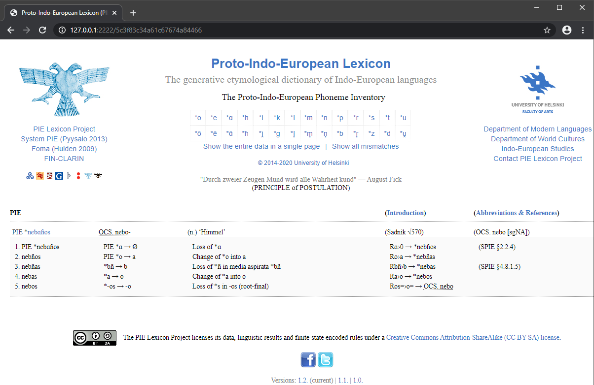

# Lexeme Primary Key URL GET Requests
## Node.js ECMAScript 2015 (ES6) Refactor
## Featuring Promise Chaining and Arrow Functions

My code in `app.js` renders one Proto-Indo-European (PIE) root or word (lexeme) at a time. Each lexeme has a permanent, primary key identifier in the database. A lexeme's identifier may be added to the URL in the browser bar. Tags may be added to URLs as desired. While the permanent, primary key identifier will never change, word forms and other data may be updated.

For example, for OCS _nebo_ (n.) ‘Himmel’ (PIE *_nebɑɦos_), the permanent URL would be:

* pielexicon.hum.helsinki.fi/**5c3f83c34a61c67674a84466**

If we wanted to bookmark and share the URL with original OCS Cyrillic, PIE reconstruction, or otherwise tweak it, no problem:

* pielexicon.hum.helsinki.fi/**5c3f83c34a61c67674a84466**_?ocs=nebo&pie=_**nebɑɦos**
* pielexicon.hum.helsinki.fi/**5c3f83c34a61c67674a84466**_?ocs=небо&pie=_**nebɑɦos**
* pielexicon.hum.helsinki.fi/**5c3f83c34a61c67674a84466**_?pie=_**nebɑɦos**
* pielexicon.hum.helsinki.fi/**5c3f83c34a61c67674a84466**_?ocs=_**nebo**

Since the permanent primary key identifier (in this case, 5c3f83c34a61c67674a84466) always stays the same, the bookmarks would always work, even if PIE or daughter language lexemes are updated in the database.

## Screenshot

